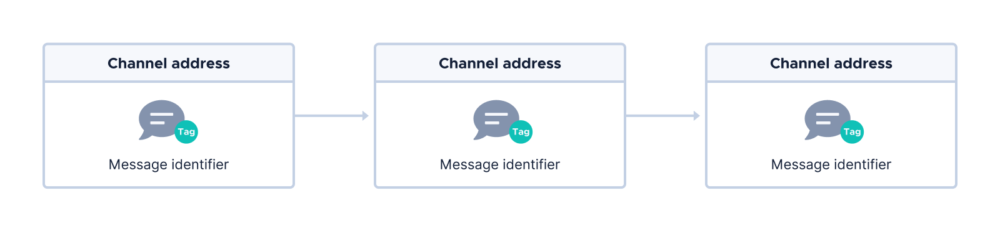
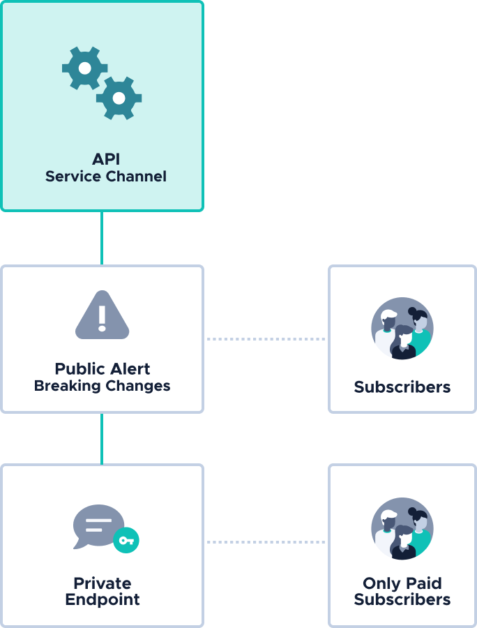
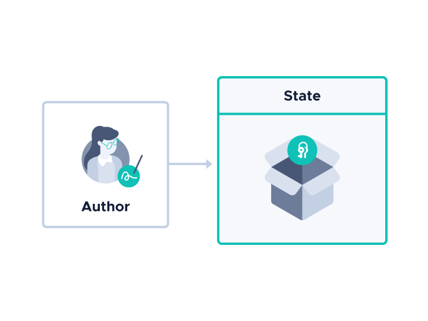
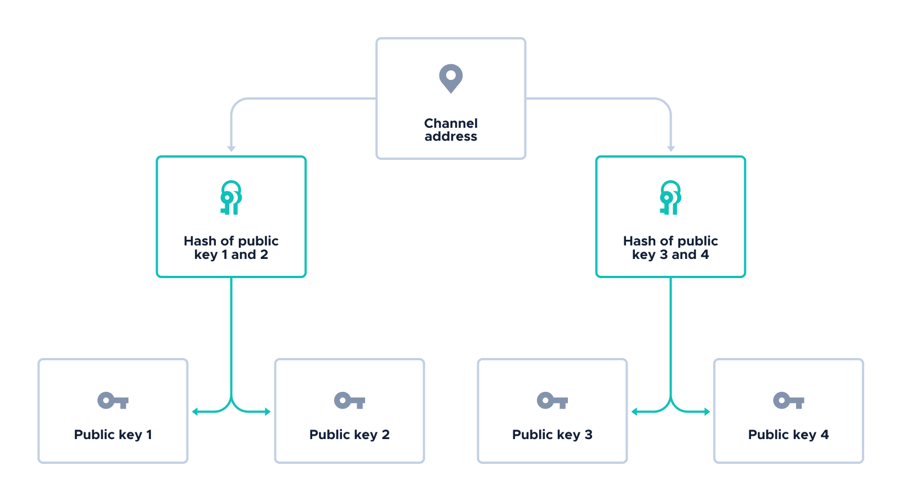

# How Channels works

**Channels is a built-in [Streams](root://iota-streams/1.0/overview.md) protocol for building secure messaging applications that have a single owner and one or more subscribers. Messages can be published on any communication channel, including the Tangle as a default.**

## Roles

Each channel has **one owner, called the author** who is responsible for announcing the channel so that future messages can be published on it.
​
Once the author has announced a channel, **one or more subscribers** can communicate asynchronously with both each other and the author by publishing messages on the channel.

## Communication channels and links

Messages can be published on any communication channel such as HTTP and addressed by a link, which includes the channel address and the message identifier. Links can be of many types, depending on the communication channel. For example, for HTTP, the link type could be a URL.

The channel address is what identifies a channel. Each message in the same channel has the same channel address, which is generated from the author's [signature keys](#signature-keys). This allows the author and subscribers to find messages on the same channel and allows the author prove ownership of the channel by signing messages.

The message identifier identifies individual messages on a channel, allowing the author and subscribers to differentiate messages they've read from those they haven't and to find specific messages on a channel.

By default, Channels comes with an API for publishing messages on the [Tangle](root://getting-started/0.1/network/the-tangle.md) and addressing them by an `Address` link type.

The `Address` link type includes the channel address in the `address` field of a [transaction](root://getting-started/0.1/transactions/transactions.md) and the message identifier is in the `tag` field of a transaction.

## Messages

The contents of each message is defined by its [type](#message-types), which contains information about how it should be cryptographically processed.

For example, an author's message may contain a masked payload as well as a signature. This content must be processed in a specific way that allows subscribers to decrypt it and verify the signature.

### Message types

Messages can be one of seven types, which can be created and published only by particular roles.

|**Message type**| **Description**| **Published by**|
|:-----------|:-----------|:---------------------------------------|
|| All channels must start with an `Announce` message. This message contains information that allows subscribers to process other messages on the same channel and to publish their own messages | Author|
|| Publishes the author's new [public MSS key](#author) and authenticates it with the previous one, allowing the author to sign messages with the new private key without changing the channel address| Author|
||Publishes a session key that's encrypted for a set of authorized subscribers to give them access to masked payloads in subsequent `TaggedPacket` and `SignedPacket` messages|Author|
|| Publishes public and/or masked payloads that are authenticated with a [message authentication code](https://searchsecurity.techtarget.com/definition/message-authentication-code-MAC), which is used to prove that a payload is unchanged|Author and subscribers|
||Publishes a signed message that includes a public and/or masked payload| Author|
|| Publishes the subscriber's public NTRU key on the channel so that the author can use it to publish a `Keyload` messages| Subscribers
|| Publishes the subscriber's intent to unsubscribe from the channel to save the author the trouble of generating a session key for the subscriber|Subscribers

## Payloads

You can publish your own custom data on a channel in public (unencrypted) or masked (encrypted) payloads.

Payloads can be published in `SignedPacket` and `TaggedPacket` messages.

:::info:
`SignedPacket` messages can be published **only by authors** because only authors have [signature keys](#signature-keys).
:::

For example, if an author were an API service, that author may want all subscribers to be able to see a public alert about breaking changes. However, the author may also want to keep some messages private such as sensor data from a private endpoint. In this case, the author would send the breaking changes as a public payload, but encrypt the sensor data in a masked payload, using a session key.

## States

The author and subscribers have states, which store important information that they need for [processing messages](#processing-messages).

For both the author and subscribers, the state contains references to the messages that have already been processed as well as the cryptographic result of processed messages, which is called the spongos state.

An author's state may also include:

- A private [signature key](#signature-keys), which is used to sign a message
- A private [encryption key](#encryption-keys), which is used by subscribers to create `Subscribe` messages
- The encryption keys of any trusted subscribers. These keys are used to create `Keyload` messages.

A subscriber's state may also include:

- A private encryption key, which is used to process `Keyload` messages
- The author's public encryption key, which may be used when creating `Keyload` and `Subscribe` messages
- The author's current public signature key, which is used to verify signatures in signed messages

## Encryption keys

To encrypt masked payloads, the author uses a session key. This key is encrypted with the authorized subscribers' public encryption keys and published in `Keyload` messages for them to decrypt and use.

Subscribers can have one of the following encryption keys:

- A pre-shared key
- An NTRU key pair

The author may also have an optional NTRU key pair, which allows subscribers to publish `Subscribe` messages.

## Signature keys

Only authors have signature keys, which are used to sign messages and prove ownership of the channel.
​
To sign messages, the author uses a [Merkle signature scheme (MSS)](https://en.wikipedia.org/wiki/Merkle_signature_scheme). This signature scheme uses a pseudo-random number generator and a secret string to generate [Winternitz one-time signature keys](https://en.wikipedia.org/wiki/Hash-based_cryptography#One-time_signature_schemes). These signatures are quantum robust, meaning that they are resistant against attacks by quantum computers. However, the 'one-time' part, means that each private key can be used only once. Therefore, authors need to decide in advance how many private keys to pre-generate because the public half of these keys is then used to generate the channel address, which is also the Merkle root.
​

To verify signatures, subscribers use the author's public signature key from either an `Announce` message or a `ChangeKey` message.

## Processing messages

The author and subscribers process messages according to their [type](#message-types), using a corresponding `unwrap()` method.
​
The `unwrap()` method uses the author's or subscriber's state to process a message and extract the message's content.
​
For example, when a subscriber processes a `Keyload` message, the `unwrap_keyload()` method uses the subscriber's state to decrypt the session key. Then, the result of processing the `Keyload` message would be added to the subscriber's spongos state, which can be used to decrypt payloads in future `TaggedPacket` and `SignedPacket` messages.

## Linking messages

So that receivers know whether they are processing messages in the correct order, all messages, except the `Announce` message, must be linked to another message in the channel.

This means that messages on a channel can fork into many directions, depending on the use case. For example, a message may link to another message that contains supplementary information.

The order in which you and your subscribers publish and process messages is messaging workflow.
​
## Next steps
​
[Design your own messaging workflow](guides/designing-the-workflow.md).