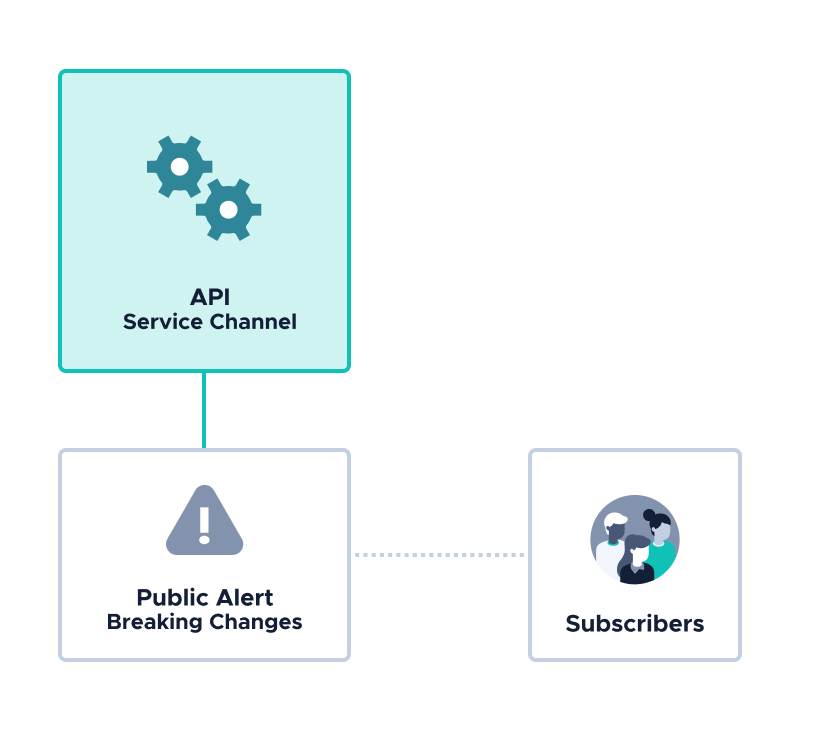

# Build your first Channels application

**This tutorial guides you through the process of building an application, using the Channels protocol. At the end of the tutorial, you will have an example application that publishes a signed message to the Tangle about an API's breaking changes.**



:::info:Just want to run some code?
A full CLI example, including publishing masked payloads is available on [GitHub](https://github.com/JakeSCahill/channels-examples).
:::

## Prerequisites

To complete this guide, you need the following:
- [Rust](https://www.rust-lang.org/tools/install)
- (Optional) An IDE that supports Rust autocompletion. We recommend [Visual Studio Code](https://code.visualstudio.com/Download) with the [rust-analyzer](https://marketplace.visualstudio.com/items?itemName=matklad.rust-analyzer) extension

## References

If you're new to Rust, or don't understand something in the code, the following resources might be useful:

- [Rust Book](https://doc.rust-lang.org/book/)
- [Rust documentation](https://doc.rust-lang.org/std/) (you can also open the documentation offline with the `rustup doc` command)
- IOTA Streams API documentation (use the `cargo doc --open` command to open the API documentation in your default web browser)
- [Types of Channels message](../how-it-works.md#message-types)

## Step 1. Create your project

The best way to start a new project is to use the [Cargo](https://doc.rust-lang.org/book/ch01-03-hello-cargo.html) build tool because it handles a lot of tasks for you such as building your code and downloading and building the dependencies.

In this step, you use Cargo to create a new project and install the dependencies.

1. Use Cargo to create a new project. You can replace `author` with your own project name if you want.

    ```bash
    cargo new author
    ```

    This command creates a new directory that's named after your project.

    Inside that directory is a `Cargo.toml` file, which contains your project's configuration settings.

2. Open the `Cargo.toml` file, and add the following dependencies under the `[DEPENDENCIES]` section

    ```bash
    iota-streams = { git = "https://github.com/iotaledger/streams" }
    failure = "0.1"
    iota-lib-rs = "0.4"
    ```

Now you have all the dependencies, you're ready to start coding.

## Step 2. Announce the API channel

In this step, you write a function that announces a new channel. This channel is the one on which your API author will publish messages for subscribers to read.

1. In the `src` directory, create a new directory called `api_author` and create two files inside it: `mod.rs` and `announce.rs`

2. In the `announce.rs` file, import the dependencies

    ```rust
    use iota_streams::app_channels::api::tangle::{Author, Transport, Address};
    use failure::Fallible;
    ```

3. Create a function called `start_a_new_channel`

    ```rust
    pub fn start_a_new_channel<T: Transport>(author: &mut Author, client: &mut T, send_opt: T::SendOptions) -> Fallible<Address> {
    }
    ```

    As well as the author, this function takes a generic type that implements the [`Transport`](https://github.com/iotaledger/streams/blob/master/iota-streams-app/src/transport/tangle/client.rs) trait for sending and receiving messages.

    In Channels, the IOTA client library is extended to implement this trait, which means that we can use it to create a [bundle](root://getting-started/0.1/transactions/bundles.md) from messages and send them to a node.

    :::info:
    In Rust, it's best practice to follow the convention of using underscores to separate words (snake_case) in the names of functions and variables.
    :::   

4. Create an [`Announce`](../how-it-works.md#message-types) message, which you can later use to publish the channel on the Tangle

    ```rust
    let announcement = author.announce()?;
    ```

    :::info:
    The [`?`](https://doc.rust-lang.org/edition-guide/rust-2018/error-handling-and-panics/the-question-mark-operator-for-easier-error-handling.html) operator is for handling any errors that may be produced while creating the message.
    :::

5. Publish your channel on the Tangle

    ```rust
    client.send_message_with_options(&announcement, send_opt)?;
    println!("Channel published");
    ```

    The `send_message_with_options()` method uses the IOTA client library to convert messages into bundles and send the resulting transactions to a node.

    This method returns an error only if the bundle was not sent to the node. Therefore, if you see no error, the bundle was sent.

6. Return the `Announce` message identifier

    ```rust
     Ok(announcement.link)
    ```

    As an author, you must send the channel address and the message identifiers of messages to anyone who wants to read them. In this tutorial, you'll do this by passing them to the subscriber as command-line arguments.

7. In the `mod.rs` file, add the following to expose this module to the rest of your project

    ```rust
    pub mod announce;
    ```

## Step 3. Publish a public payload about breaking changes

In this step, you write a function that creates and publishes a `SignedPacket` message on your channel.

1. In the `api_author` directory, create a new file called `send_message.rs`

2. In the `send_message.rs` file, import the dependencies

    ```rust
    use iota_streams::app_channels::api::tangle::{Author, Address, Transport};
    use iota_streams::protobuf3::types::Trytes;
    use iota_streams::core::tbits::Tbits;
    use std::str::FromStr;
    use failure::{Fallible, bail};
    ```

3. Create a function called `send_signed_message`

    ```rust
    pub fn send_signed_message<T: Transport>(author: &mut Author, channel_address: &String, announce_message_identifier: &String, public_payload: &String, client: &mut T, send_opt: T::SendOptions ) -> Fallible<Address> {
    }
    ```

    As well as the author, this method takes a public payload to publish on the channel, and the message identifier of the `Announce` message to link to.

    For more information about linking, see [Designing the messaging workflow](../guides/designing-the-workflow.md).

4. Convert the public payload to a Trytes type

    ```rust
    let public_payload = Trytes(Tbits::from_str(&public_payload).unwrap());
    ```

5. Convert the channel address and the `Announce` message identifier to an `Address` type

    ```rust
    let announcement_link = match Address::from_str(&channel_address, &announce_message_identifier){
        Ok(announcement_link) => announcement_link,
        Err(()) => bail!("Failed to create Address from {}:{}", &channel_address, &announce_message_identifier),
    };
    ```

6. Create a `SignedPacket` message, using the payloads and the announcement link

    ```rust
    let empty_masked_payload = Trytes(Tbits::from_str("").unwrap());
    let message = author.sign_packet(&announcement_link, &public_payload, &empty_masked_payload)?;
    println!("Sending signed message");
    ```

    The `sign_packet()` method expects a public payload and a masked payload. For this example, the masked payload is empty because it can't be encrypted without first creating a `Keyload` message.

    The `SignedPacket` message is linked to the `Announce` message because it contains the information that allows the subscriber to verify the signed message.

7. Publish the message on the channel

    ```rust
    client.send_message_with_options(&message, send_opt)?;
    println!("Published signed message");
    ```

8. Return the `SignedPacket` message identifier

    ```rust
     Ok(message.link)
    ```

## Step 4. Create the author

In this step, you create the main function that calls the ones you just created.

1. In the `src/main.rs` file, import the dependencies, including the functions in the module that you just created

    ```rust
    use iota_streams::{
    app_channels::api::tangle::{Author}
    };
    use iota_lib_rs::prelude::iota_client;
    use iota_streams::app::transport::tangle::client::SendTrytesOptions;
    mod api_author;
    use crate::api_author::announce::start_a_new_channel;
    use crate::api_author::send_message::send_signed_message;
    ```

2. In the `main()` function, connect to an IOTA node and change the default settings to use [remote proof of work](root://getting-started/0.1/transactions/proof-of-work.md)

    ```rust
    let mut client = iota_client::Client::new("https://nodes.devnet.iota.org:443");

    let mut send_opt = SendTrytesOptions::default();
    send_opt.min_weight_magnitude = 9;
    send_opt.local_pow = false;
    ```

3. Create an instance of the `Author` object

    ```rust
    let mut author = Author::new("MYAUTHORSECRETSTRING", 3, true);
    ```

    For more information about creating an author, see [Designing the messaging workflow](../guides/designing-the-workflow.md).

    :::danger:Do not share the secret string
    In production applications, you should change the author's secret string.

    The same secret string will always result in the same seed. Therefore, you should not share it with anyone, otherwise you risk giving others ownership of your channel.
    :::

4. Get the author's channel address and convert it to a string of trytes so you can later print it to the console

    ```rust
    let channel_address = author.channel_address().to_string();
    ```

5. Call your module's functions to publish the `Announce` and `SignedPacket` messages

    ```rust
    let announce_message = start_a_new_channel(&mut author, &mut client, send_opt).unwrap();
  
    let public_payload = "BREAKINGCHANGES";

    let signed_message = send_signed_message(&mut author, &channel_address, &announce_message.msgid.to_string(), &public_payload.to_string(), &mut client, send_opt).unwrap();

6. Print the command for subscribing to the channel to the console

    ```rust
    println!("");
    println!("Now, in a new terminal window, use the subscriber to publish a `Subscribe` message on the channel");
    println!("");
    println!("cargo run --release --bin subscriber {} {} {}", channel_address, announce_message.msgid, signed_message.msgid);
    println!("");
    ```

    The subscriber needs all this information to get the messages from the channel.

## Step 4. Set up the subscriber

In this step, you write a function to read the author's messages from the Tangle and verify them. 

1. Inside the `src` directory, create a new directory called `bin`

2. Inside the `bin` directory, create a file called `subscriber.rs`

3. Add the following at the top of the file to import your dependencies

    ```rust
    use iota_streams::app_channels::{
    api::tangle::{Address, Transport, Subscriber}
    , message
    };
    use iota_lib_rs::prelude::iota_client;
    use failure::{Fallible, ensure, bail};
    use std::env;
    ```

4. Define a new function called `get_announcement`

    ```rust
    fn get_announcement<T: Transport>(channel_address: &String, announce_message_identifier: &String, client: &mut T, recv_opt: T::RecvOptions) -> Fallible<()> {
    }
    ```

    This function is similar to the `start_a_new_channel()` function, except it also takes the channel address and the message identifier, which are used to read the message on the Tangle.

5. Use the `client` object to get the message from the Tangle

    ```rust
    let announcement_link = match Address::from_str(&channel_address, &announce_message_identifier){
        Ok(announcement_link) => announcement_link,
        Err(()) => bail!("Failed to create Address from {}:{}", &channel_address, &announce_message_identifier),
    };
    println!("Receiving announcement message");
    let list = client.recv_messages_with_options(&announcement_link, recv_opt)?;
    ```

6. Iterate through the returned messages and make sure that they are `Announce` messages by checking the header

    ```rust
    for tx in list.iter() {
        let header = tx.parse_header()?;
        ensure!(header.check_content_type(message::announce::TYPE));
        subscriber.unwrap_announcement(header.clone())?;
        println!("Found and verified {} message", header.content_type());
        break;
    }
    Ok(())
    ```

    You need to iterate through messages here because the Tangle may contain more than one `Announce` message with your channel address and message identifier.

    For example, an author may have sent the same `Announce` message more than once, or someone else may have reattached the `Announce` message.

    :::info:
    The `unwrap_announcement()` method verifies any messages that it finds by validating the signature against the channel address.

    This method also saves the author's information in the subscriber's [state](../how-it-works.md#states) so that you can use it to read other messages without having to unwrap the announcement again.
    :::

7. Define a new function called `get_messages`, which is similar to the `get_announcement` function, except it finds and verifies `SignedPacket` messages

    ```rust
    fn get_signed_messages<T: Transport>(subscriber: &mut Subscriber, channel_address: &String, signed_message_identifier: &String, client: &mut T, recv_opt: T::RecvOptions) -> Fallible<()> {
        
        // Convert the channel address and message identifier to a link
        let message_link = match Address::from_str(&channel_address, &signed_message_identifier){
            Ok(message_link) => message_link,
            Err(()) => bail!("Failed to create Address from {}:{}", &channel_address, &signed_message_identifier),
        };
    
        println!("Receiving signed messages");
    
        // Use the IOTA client to find transactions with the corresponding channel address and tag
        let list = client.recv_messages_with_options(&message_link, recv_opt)?;

        // Iterate through all the transactions and stop at the first valid message
        for tx in list.iter() {
            let header = tx.parse_header()?;
            ensure!(header.check_content_type(message::signed_packet::TYPE));
            let (public_payload, masked_payload) = subscriber.unwrap_signed_packet(header.clone())?;
            println!("Found and verified messages");
            println!("Public message: {}, private message: {}", public_payload, masked_payload);
            break;
        }
        Ok(())
    }
    ```

8. In the `main()` function, add the code to connect to an IOTA node, and call the functions

    ```rust
    // Create a new subscriber
    // REPLACE THE SECRET WITH YOUR OWN
    let mut subscriber = Subscriber::new("MYSUBSCRIBERSECRETSTRING", true);

    // Connect to an IOTA node
    let mut client = iota_client::Client::new("https://nodes.devnet.iota.org:443");

    // Get the arugments that were passed to the subscriber
    let args: Vec<String> = env::args().collect();

    let channel_address = &args[1];
    let announce_message_identifier = &args[2];
    let signed_message_identifier = &args[3];

    let recv_opt = ();

    match get_announcement(&mut subscriber, &channel_address.to_string(), &announce_message_identifier.to_string(), &mut client, recv_opt){
        Ok(()) => (),
        Err(error) => println!("Failed with error {}", error),
    }

    match get_signed_messages(&mut subscriber, &channel_address.to_string(), &signed_message_identifier.to_string(), &mut client, recv_opt){
        Ok(()) => (),
        Err(error) => println!("Failed with error {}", error),
    }
    ```

    When you create an instance of the `Subscriber` object, you specify the secret and whether to generate encryption keys. The secret is used to generate the encryption keys.

    :::danger:Do not share the secret string
    In production applications, you should change the subscriber's secret string.

    The same secret string will always result in the same seed. Therefore, you should not share it with anyone, otherwise you risk giving others ownership of your subscriber's messages.
    :::

:::success:Congratulations :tada:
You've got an author application that publishes a signed message on a new channel, and you've got a subscriber application that reads and verifies the message.
:::

## Next steps

Take a look at the [full example](https://github.com/JakeSCahill/channels-examples) and get involved by discussing your own ideas in the #streams-discussion channel on [Discord](https://discord.iota.org/).


